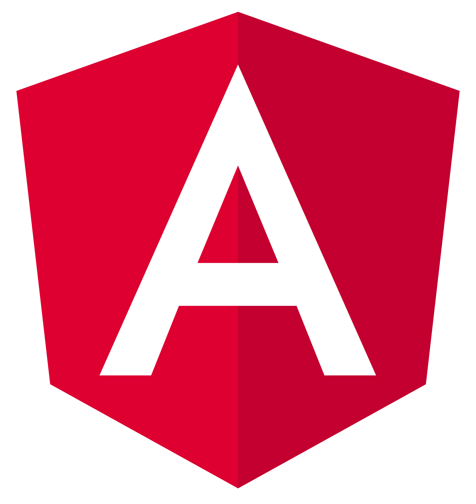

# Hi there 👋

- 🔭 I’m currently working on Javascript/Typescript projects, but I can code in some other technologies
- 🌱 I’m currently learning Go
- 💬 Ask me about anything, if I don't know the answer, I'll come up with something 😁
- 📫 Reach me on Twitter [@jmrg_atx](https://twitter.com/jmrg_atx)
- 😄 Pronouns: He/His
- ⚡ Fun fact: Love travelling, scuba diving and dancing, weird as engineer (?)

## Languages and tools I know:

### FE

### BE

### Cloud

